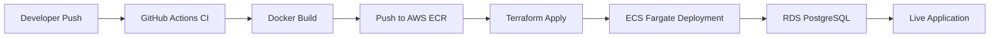
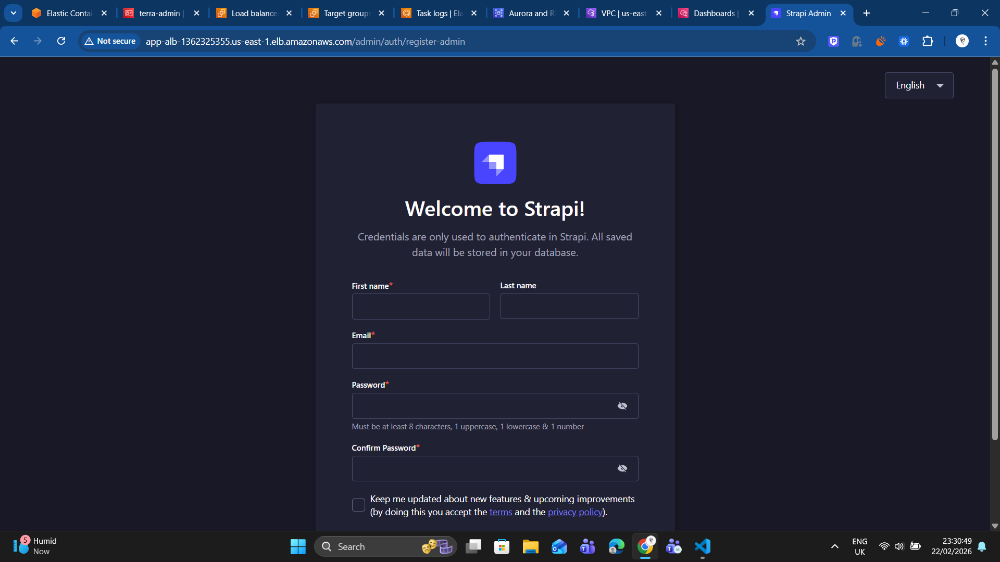

# 🚀 Strapi Deployment on AWS ECS Fargate  
### Terraform • GitHub Actions • Production-Ready CI/CD

Production-grade Infrastructure as Code (IaC) project that provisions and deploys a **Strapi application** on **AWS ECS Fargate**, fully automated using **Terraform** and **GitHub Actions CI/CD pipelines**.

---

## 📌 Architecture Overview

screenshots/architecture.jpg

🏗️ Infrastructure Stack
Service	Purpose
AWS ECS Fargate	Serverless container orchestration
AWS ECR	Docker image registry
AWS RDS (PostgreSQL)	Managed relational database
AWS VPC	Networking layer
IAM Roles & Policies	Secure access control
CloudWatch Logs	Monitoring & logging
Terraform	Infrastructure as Code
GitHub Actions	CI/CD automation

 CI/CD Workflow
🔹 CI Pipeline (ci.yml)

Install dependencies

Build Docker image

Tag image with commit SHA

Push image to Amazon ECR

🔹 CD Pipeline (cd.yml)

Terraform Init

Terraform Validate

Terraform Plan

Terraform Apply

Deploy new ECS task revision

🔹 Destroy Pipeline (destroy.yml)

Terraform Destroy

Clean infrastructure safely

📁 Project Structure
.
├── .github/workflows/
│   ├── ci.yml
│   ├── cd.yml
│   └── destroy.yml
│
├── terraform/
│   ├── main.tf
│   ├── variables.tf
│   ├── outputs.tf
│   ├── ecs.tf
│   ├── rds.tf
│   ├── vpc.tf
│   └── iam.tf
│
├── app/
│   ├── Dockerfile
│   └── Strapi source code
│
└── README.md

⚙️ Deployment Flow

Developer pushes code to GitHub

CI builds Docker image & pushes to ECR

CD runs Terraform

ECS pulls latest image

Fargate deploys updated container

Application connects to RDS

🛡️ Production-Ready Practices

✔ Infrastructure fully managed via Terraform
✔ No manual AWS Console changes
✔ Image tagging using commit SHA
✔ IAM least privilege principle
✔ Stateless container design
✔ Remote state ready (S3 backend supported)
✔ Modular Terraform structure
✔ Separate CI / CD / Destroy workflows

📸 Screenshots

Place screenshots inside:

/screenshots
  ├── 1> ECR-repo .png
  ├── 2> IAM-rules.png
  ├── 3> ecs-loadbalancer.png
  ├── 4> Target group.png
  ├── 5> Cloudwatch logs.png
  ├── 6> RDS - Postgres - DB.png
  ├── 7> Cloudwatch- Dashboard.png
  ├── 8> Strapi-app-live.png
  ├── 9> Terraform-apply-local.png

Example:

🚀 Local Terraform Usage
# Initialize Terraform
terraform init

# Validate configuration
terraform validate

# Preview infrastructure changes
terraform plan

# Apply changes
terraform apply

Or simply push code to trigger GitHub Actions.

🧠 What This Project Demonstrates

Real-world DevOps workflow

End-to-end CI/CD automation

Containerized cloud deployment

Infrastructure as Code best practices

Production-grade AWS architecture

Internship-level industry readiness

📄 License

This project is licensed under the MIT License - see the LICENSE
 file for details.

👨‍💻 Author

Aman Yadav
DevOps & Cloud Enthusiast
Pune, India

## 🏆 Why This Project Stands Out

This project demonstrates:

- Real-world GitOps workflow
- Fully automated infrastructure provisioning
- Immutable container deployment strategy
- CI/CD separation of concerns (Build vs Deploy)
- Production-grade AWS architecture
- Zero manual console dependency
- Clean infrastructure teardown support

Designed to reflect how DevOps teams operate in modern SaaS companies.
---
